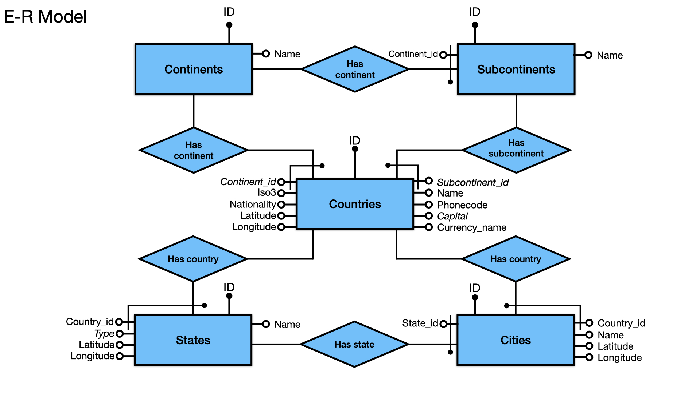
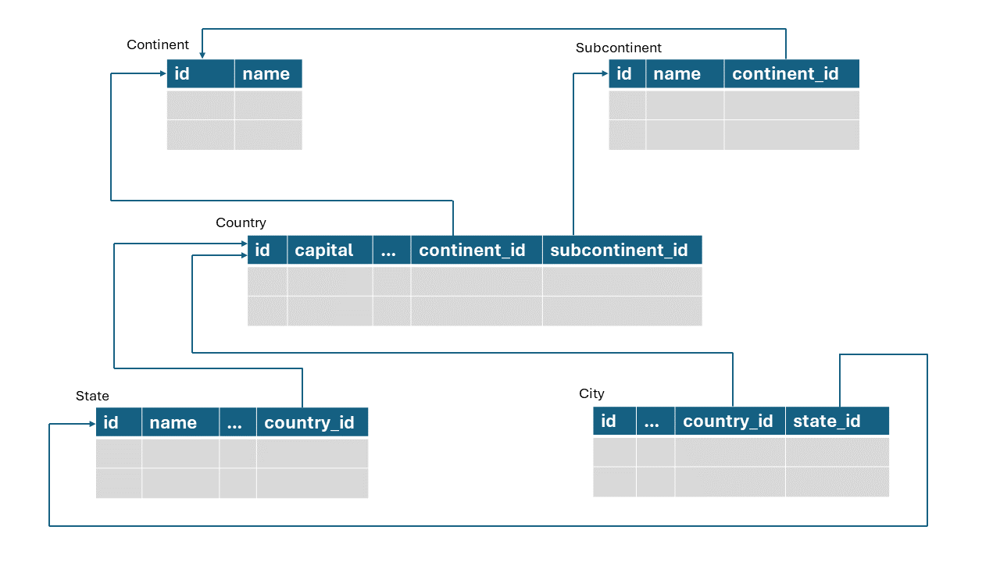
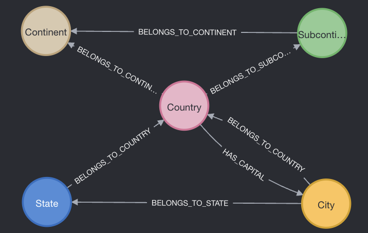

# DMDS exam project
Professors: Prof. Rosati, Prof. Lembo.

Project members: Felli Stefano (1896877), Cirillo Lorenzo (1895955).

## Chosen Database: Countries-States-Cities (https://www.kaggle.com/datasets/darshangada/countries-states-cities-database?select=csv)
The database contains a collection of data providing detailed geographical information about cities, states, countries, continents, and sub continents, each one modeled as a table. 

There are 155.935 entries in total, broken down as follows in six tables:
* Total Continents : 6
* Total Sub Continents : 22
* Total Countries : 250
* Total States/Regions/Municipalities/Provinces : 5,084
* Total Cities/Towns/Districts : 150,573

## Entity Relationship model
The following E-R model reports all the entities, relationships and constraints that structure the database


## Relationships between tables


## Homework 1 and 2:

### Chosen Database Management System: 
PostgreSQL.

### Modeling: 
For each table, the attributes and the constraints are modeled in the following way:
* CONTINENTS(__id__, name)
* SUBCONTINENTS(__id__, name, continent_id)
* COUNTRIES(__id__, name, iso3, phonecode, *capital*, currency_name, *continent_id*, *subcontinent_id*, nationality, latitude, longitude)
* STATES(__id__, name, country_id, *type*, latitude, longitude)
* CITIES(__id__, name, state_id, country_id, latitude, longitude)

N.B. black dotted/bold attributes are primary keys, italic attributes can assume NULL values.

### Get Started
In Python:
* run ```/hw_1_2/geographic_db/csv/preprocess.py``` (to preprocess the csv files)

In PostgreSQL:
* run ```/hw_1_2/geographic_db/database_definition.sql``` (to create tables)
* import tables from csv files via graphical interface
* run ```/hw_1_2/geographic_db/constraints_and_updates.sql``` (to set constraints on tables)
* run ```/hw_1_2/queries_and_opt/query_n.sql``` (to run the queries)

## Homework 3:

### Chosen Database Management System: 
Neo4j: graph database in which data are stored as nodes and relationships between these nodes, rather than as traditional relational tables. This allows for executing very complex and deep queries more efficiently compared to traditional relational databases when dealing with highly connected data. The query language used by Neo4j is Cypher.


### Why Neo4j:
We decided to implement our work on Neo4j because, as shown in the E-R model, tables are related through *binary* relationships, easily modelable in neo4j, each one connecting two nodes, representing tuples in the database.

Unlike relational databases, where joins can become as seen performance bottlenecks, Neo4j uses graph pattern matching to navigate between nodes and edges, ensuring consistent query performance especially for deep and complex queries. This is particularly advantageous when querying for related data across multiple levels (e.g., find all cities in a continent).

### Modeling: 
Thanks to the usage of a graph database, we managed to implement the addictional edge __'HAS_CAPITAL'__ that we couldn't model with the relational db approach. This edge links each sample of *Country* nodes to the relative *City* node that expresses the capital of that country.
The workflow is:
- find the capitals that are not represented as a *City* node
- create the *City* node for each of those capitals
- create the edges __'HAS_CAPITAL'__ and __'BELONGS TO COUNTRY'__ to connect them to their corresponding country

## Graph DB schema


### Get Started
* run the Cypher code written in ```/hw_3/scripts/import_db.txt``` to create all nodes, edges, constraints
* run the n-th Cypher query written in ```/hw_3/scripts/queries.txt``` to run the n-th query
