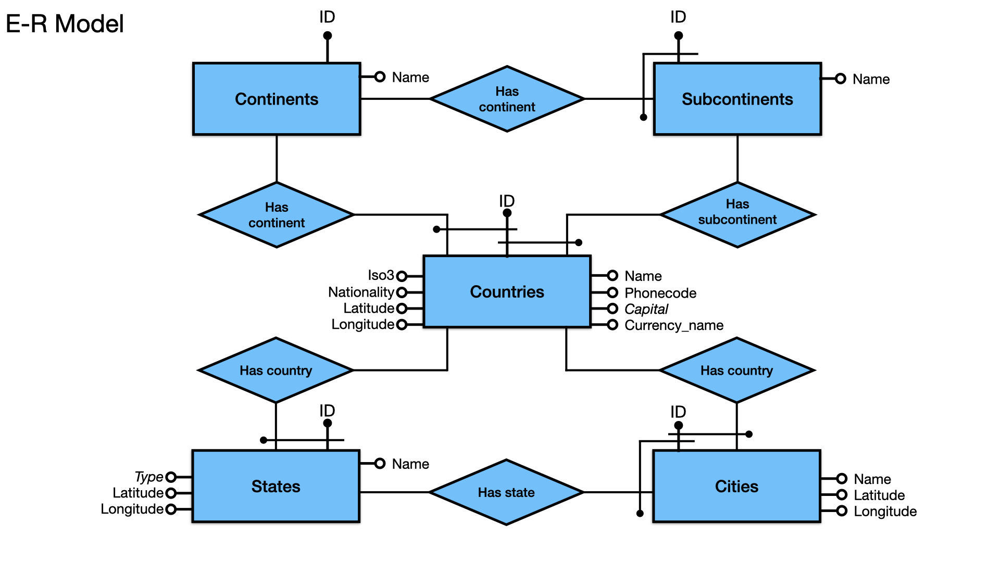

# DMDS exam project
Professors: Prof. Rosati, Prof. Lembo.

Project members: Felli Stefano (1896877), Cirillo Lorenzo (1895955).

Database Management system: PostgreSQL.

## Chosen Database: Countries-States-Cities (https://www.kaggle.com/datasets/darshangada/countries-states-cities-database?select=csv)
The database contains a collection of data providing detailed geographical information about cities, states, countries, continents, and sub continents, each one modeled as a table. 

There are 155.935 entries in total, broken down as follows:
* Total Continents : 6
* Total Sub Continents : 22
* Total Countries : 250
* Total States/Regions/Municipalities/Provinces : 5,084
* Total Cities/Towns/Districts : 150,573

## Entity Relationship model
The following E-R model reports the structure and all the constraints of the database


For each table, the attributes and the constraints are resumed:
* CONTINENTS(__id__, name)
* SUBCONTINENTS(__id__, name, continent_id)
* COUNTRIES(__id__, name, iso3, phonecode, *capital*, currency_name, *continent_id*, *subcontinent_id*, nationality, latitude, longitude)
* STATES(__id__, name, country_id, *type*, latitude, longitude)
* CITIES(__id__, name, state_id, country_id, latitude, longitude)

N.B. black dotted/bold attributes are primary keys, italic attributes can assume NULL values.

## Get Started
* run ```/hw_1_2/geographic_db/csv/preprocess.py``` (to preprocess the csv files)

In PostgreSQL:
* run ```/hw_1_2/geographic_db/database_definition.sql``` (to create tables)
* import tables from csv files via graphical interface
* run ```/hw_1_2/geographic_db/constraints_and_updates.sql``` (to set constraints on tables)
* run ```/hw_1_2/queries_and_opt/query_n.sql``` (to run the queries)
